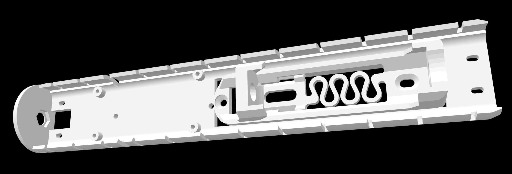

# LoRa "Baton Node" — 40 mm PVC

This repository documents the construction of a tubular ("baton" style) LoRa
repeater node, designed for continuous, autonomous outdoor operation under severe
weather. A 3D-printed internal sled slides into a hermetically sealed PVC pipe,
giving IP68 protection against rain and heat without compromising RF efficiency.



## 🛠️ Hardware

- **Core & radio:** RAK19007 Base Board with a WisBlock LoRa Core (nRF52840) at
  **923.125 MHz** (Brazilian frequency plan).
- **Power:** 3.2 V battery with BMS protection, charged by a 5 W / 5 V solar panel
  through a cable gland. Although not officially documented by the manufacturer,
  chip engineers acknowledge that this 3.2 V configuration performs significantly
  better and is safer in hot climates where the battery sits in the sun.
- **Antenna:** IPEX-to-SMA-female pigtail mounted on the top cap.

## 🏗️ Mechanical structure (the sled)

To keep components secure and prevent vibration-induced shorts, the node uses a
custom internal chassis, printed as a single piece.

- **Size:** **200.5 mm** end to end, **34.02 mm** across the wings — a sliding
  interference fit inside Brazilian 40 mm PVC pipe.
- **Cable management:** five pairs of oblong slots (4.0 × 2.2 mm) take nylon zip
  ties — two pairs near the antenna end, two flanking the battery, one on the tail —
  and two dedicated side slots route the LoRa and BLE antenna wires safely under the
  board instead of letting them chafe between the plate and the pipe wall.
- **Battery:** an 18650 holder with a print-in-place spring drops into a through
  cutout in the plate.
- **Antenna end:** a Ø34.4 mm circular flange closes the tube, with a hex recess
  (8.41 mm across flats) that keys the panel-mount SMA female connector.
- **Board mounting:** the four M2 holes stand the board off the base, leaving the
  gap free for the wiring that runs underneath it — 5.0 mm is the spacing commonly
  used in hermetic enclosures.
- **Pull step:** a 3 mm ridge across the tail end gives you something to push or
  hook against when sliding the sled inside the pipe.

The model is parametric OpenSCAD and **does not redraw** the third-party parts: it
imports the original STLs and unions/cuts around them, so holes, standoffs and the
spring mechanism stay exactly as their authors designed them.

## 💧 Sealing and moisture control (IP68)

The casing handles extreme thermal humidity through a layered defense.

- **Body & top cap:** 40 mm smooth white PVC pipe with a cold-welded top cap. The
  cap is drilled and sealed with PU/silicone under the washer, securing the external
  SMA female connector.
- **Base & breather valve (critical):** a threaded base adapter sealed with Teflon
  tape houses an **IP68 PTFE breather valve**. It equalizes internal pressure and
  prevents condensation ("sweating") during sudden temperature drops, keeping the
  electronics dry.

## ⚡ Power autonomy

Thanks to the ultra-low consumption of the nRF52840 and the WisBlock ecosystem, the
3.2 V cell guarantees weeks of operation even through continuous rain or full
shading. The RAK19007's native regulator efficiently manages the 5 V input from the
external solar panel to keep the cell topped up.

## Building

| File in `vendor/` | What it is | Included here? |
|---|---|---|
| `Wisblock_Plate_V1.1.stl` | WisBlock mounting plate (Ethernet/POE) | yes |
| `18650_V2.STL` | 18650 holder with printed spring | **no** — download it (see [Credits](#credits)) and drop it in `vendor/` |

```sh
openscad -o dist/Wisblock_Sled.stl wisblock_sled.scad
```

> **Measure your pipe first.** Nominal "40 mm" PVC varies by manufacturer: two
> pipes bought for this project measured **34.5** and **33.9 mm** ID — 0.6 mm apart,
> which is five times the interference the fit relies on. Set `pipe_id` to your
> measured value and everything else follows from it.
>
> That 0.6 mm is not just a diameter change: a smaller pipe lowers the pipe axis
> relative to the plate and squeezes the space above it, where the PCB lives. On the
> 33.9 mm pipe the wing tip had to go from 1.8 to 1.5 mm, and `plate_recess` from
> 0.40 to 0.15, to keep clearance over the board's components.

## Printing

**Material: PETG, ABS or ASA, 20% infill. Avoid PLA** — it deforms from the heat
that builds up inside a sealed tube in the sun. 20% is plenty — the part came out
solidly rigid in PETG at that density.

**Print it flat, on its flat face. Do not print it upright.** The holder's spring
compresses along the length (X); lying flat, the layers run in the plane of that
motion. Standing upright, X becomes the stacking direction and the spring
delaminates. The battery holder sits in a through cutout with its underside flush
with the base, so the part rests directly on the bed and needs **no support** — the
spring prints bed-supported instead of bridging.

> **Fit vs. material.** The wing geometry was tuned on PLA prototypes, where the
> wings cracked at the root, so `fit_clear` is deliberately conservative at
> −0.12 mm. PETG, ABS and ASA are far tougher and tolerate more preload: if the fit
> feels loose in your production material, go to `-0.18` or `-0.25`. That −0.25
> value is exactly what snapped in PLA — it should be safe in ASA.

### Battery contacts

The 18650 holder takes its electrical contacts from **brass standoffs**, per its
author: `M3x6+6 (20A)` or `M4x6+6 (30A)`. They are not part of the printed model.

## Key parameters

| Parameter | Value | Notes |
|---|---|---|
| `pipe_id` | `33.9` | **measured** inner diameter of your pipe — everything derives from it |
| `plate_recess` | `0.15` | how far the plate edge sits inside the circle; smaller lifts the axis and frees space for the PCB |
| `fit_clear` | `-0.12` | negative means **interference** against the pipe. See the note above |
| `wall_base` | `3.0` | **do not increase**: it eats the internal clearance and pinches the PCB |
| `wall_tip` | `1.5` | wing tip. Thinner is *stronger* here: root stress scales with thickness/length², so thinning beats shortening |
| `fillet` | `3.0` | fillet at the wing root — the main anti-crack reinforcement |
| `disc_flat` | `true` | clips the disc at z=0 → flat base, no support needed |
| `cable_swap` | `true` | swaps which side each cable slot exits on |
| `tail_len` | `15.0` | tail past the battery, carrying the zip-tie slots |
| `grip_h` | `3.0` | height of the pull step above the plate |

## Non-obvious design decisions

- **The wings grip by interference, not clearance.** v1 used +0.20 mm clearance and
  was loose. 0.25 mm of interference with a 1.4 mm tip snapped at the root under
  finger pressure alone — in PLA the failure is *interlaminar*, at the sharp inside
  corner. The fix was a 3 mm fillet at the root (it fits entirely **below** the PCB),
  a 1.8 mm tip, and less interference.
- **Wing root thickness is capped by the PCB**, not by strength: taking `wall_base`
  to 4.0 mm would drop the internal clearance from 28.18 to 26.41 mm, pinching a
  board that is ~5 mm tall with components.
- **The M2 holes are re-cut after the fillet**, otherwise it blocks a screw.
- **A through cutout instead of a step** for the battery holder: it removes the need
  for print support, lets the spring print bed-supported, and raises clearance to the
  pipe wall to 3.37 mm.
- **Side convention:** "left" = low y, "right" = high y. The high-y side is
  identifiable by a lone M2 hole 1.70 mm from the edge (y = 28.08).

## Credits

This sled builds on parts by other authors:

- **18650 battery holder with printed spring** (`18650_V2.STL`) by
  **Alex Yang (YXC)**, licensed **CC BY-NC**. Not redistributed here; download it
  from [thingiverse.com/thing:2668159](https://www.thingiverse.com/thing:2668159)
  and drop it in `vendor/`.
- **WisBlock mounting plate** (`Wisblock_Plate_V1.1.stl`) by **turbo2ltr
  (Mike Mmmmm)**, licensed **CC BY-SA**. Redistributed in `vendor/` under those same
  terms; source:
  [thingiverse.com/thing:6647288](https://www.thingiverse.com/thing:6647288).
- **RAK19007 WisBlock Base Board 2nd Gen** — the board's own 3D model, published by
  the manufacturer on the
  [RAK Wireless store page](https://store.rakwireless.com/products/rak19007-wisblock-base-board-2nd-gen),
  was used only to take measurements (60 × 30 mm). It is not part of this repository.

## License

`wisblock_sled.scad` and this documentation are the work of this repository's author.

The imported models keep their original licenses and authors, listed in
[Credits](#credits): the mounting plate is **CC BY-SA** (turbo2ltr / Mike Mmmmm) and
the 18650 holder is **CC BY-NC** (Alex Yang / YXC). The compiled mesh in `dist/` is a
derivative work of both.
