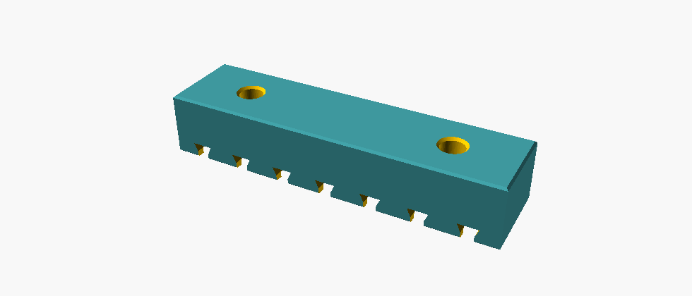
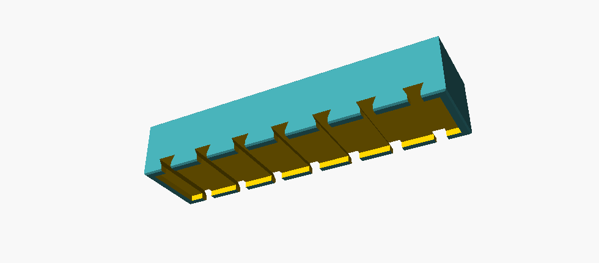
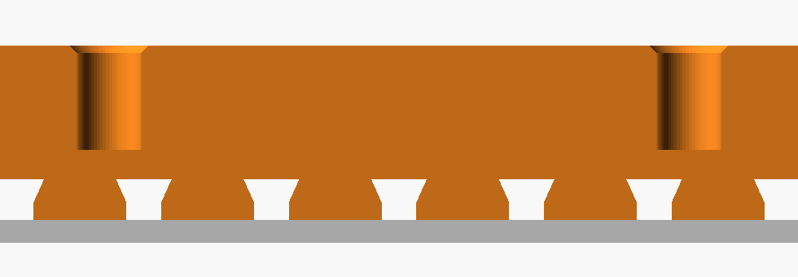
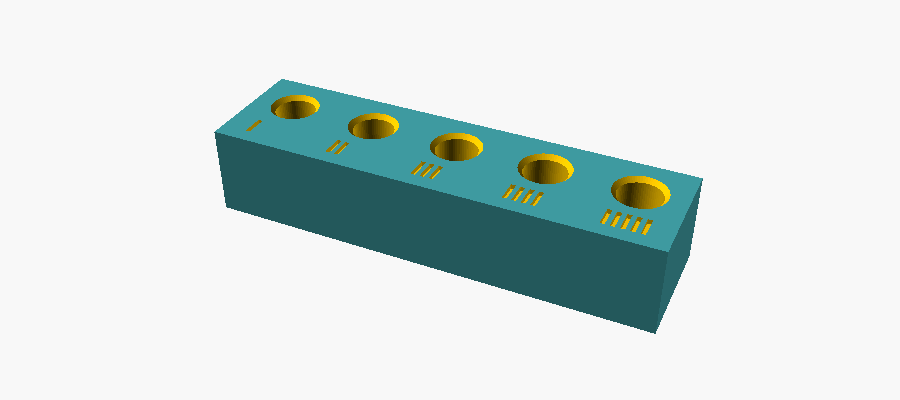

# PU Rail — trilho espaçador colado com PU

Fica **entre** a caixa hermética e uma chapa de alumínio: a face de baixo é colada na
caixa com PU, a de cima é parafusada na chapa com M4 em **insert de latão**. Serve
para pendurar a caixa numa chapa, num mastro ou numa estrutura, sem furar a caixa.



Peça: **80 × 20 × 15 mm**. O comprimento de 80 é o teto imposto pela aplicação; a
**altura de 15 é o vão** entre a caixa e a chapa — é o parâmetro que você mexe se
precisar de outro afastamento.

## Cotas

| | |
|---|---|
| Corpo | 80,0 × 20,0 × 15,0 mm |
| Pontos de fixação | 2, em x = ±25 → 50 mm entre eles, 15 mm em cada ponta |
| Furo do insert | Ø5,60 × 9,0 mm, **cego**, chanfro de entrada 0,6 |
| Fundo maciço sob o insert | 4,5 mm — a face de cola sai **sem nenhum furo** |
| Leito do PU | 76 × 16 × 1,5 mm, borda maciça de 2,0 em volta |
| Canais de ancoragem | 7, rabo de andorinha 3,0 → 4,8, descendo 2,0 abaixo do leito |
| Chanfros | 0,4 na aresta inferior externa, 0,5 no topo |
| Material sólido | 20,5 cm³ |

## A face de cola



Três coisas acontecem nesta face, e vale separar o que cada uma faz.

**O leito de 1,5 mm** dá uma linha de cola grossa. Adesivo de PU é elastomérico e
preenchedor: ele quer 1 a 3 mm. Linha fina deixa a junta rígida e sem curso para
absorver a diferença de dilatação entre o trilho e a caixa.

**A borda de 2 mm calibra essa espessura.** O trilho assenta nela e o PU fica com 1,5
parelho, em vez de depender da força da mão na hora de pressionar. É a decisão mais
valiosa do desenho.

**Os canais são rabo de andorinha, não ranhura reta** — e essa é a correção que fez a
maior diferença. Uma ranhura com a *mesma profundidade do leito* é coplanar com ele:
não ancora nada, só fura a borda. Estes descem mais 2 mm e **alargam enquanto
descem**, de 3,0 na boca para 4,8 no fundo. O PU curado dentro vira um rebite que não
sai puxando reto: para escapar teria que se espremer de 4,8 para 3,0.



| | Leito liso | **Com os canais** |
|---|---|---|
| Área colada | 1 216 mm² | **2 455 mm² (+102%)** |
| Volume de PU | 1 824 mm³ | ~3 044 mm³ |
| Ancoragem contra arrancamento | nenhuma | 7 rebites em rabo de andorinha |
| Contato da borda | — | 237 mm² |

**Por que ancoragem e não mais área.** Esta junta não falha rasgando a cola: 1 216 mm²
a 2 MPa já dariam 2,4 kN, ordens de grandeza acima do que o trilho carrega. Ela falha
**descolando na interface**, e descolamento começa numa borda e desfia. Área não
segura desfio; undercut segura.

Os canais atravessam até as duas laterais por três motivos: a borda precisa ser furada
para o excesso sair, **ar preso num canal vira bolha e bolha é onde o descolamento
começa**, e dá para conferir pelo lado de fora se o PU encheu. Os de ±33 são os que
mais importam — descolamento de junta longa começa sempre pelas pontas.

Descartei furos cegos no piso do leito, que também ancorariam: eles prendem ar sem ter
por onde sair.

## Por que insert e não rebite

Rebite seria o óbvio para chapa de alumínio. Não serve aqui, por três motivos
concretos:

1. **O bulbo se forma do outro lado da pilha** — e o outro lado é a junta colada. Ou
   você rebita antes de colar e abre um rebaixo seco para o bulbo, comendo o leito, ou
   o bulbo cura dentro do PU.
2. **Ele aperta a pilha inteira**, e a pilha inclui 15 mm de plástico. O bulbo de um
   4,8 apoia em ~40 mm²: 25–50 MPa de compressão local, no limite do PETG e acima do
   ASA — e a peça trabalha a 60–70 °C no sol. Afunda e afrouxa em uma temporada.
3. **É permanente.** A junta de PU com a caixa já é permanente por natureza, então a
   chapa é o **único lugar por onde o conjunto pode sair** para manutenção.

O insert resolve os três: fica cego pelo lado da cola, a carga vira cisalhamento
distribuído em 8 mm de serrilhado, e desmonta.

### O vento não é o critério

Conta com **40 m/s (144 km/h)**, acima do que a NBR 6123 pede para a região:

| | |
|---|---|
| Força na caixa 110 × 110 | 14,2 N |
| Força numa antena 200 × Ø10 | 2,4 N |
| Momento no plano dos trilhos | 1,13 N·m |
| **Por parafuso**, 4 pontos | **5,7 N de tração + 4,1 N de cisalhamento** |

| Insert | Área de cisalhamento | Capacidade em ASA |
|---|---|---|
| M4 4×6 | 75 mm² | ~2,3 kN |
| M4 8×6 | 151 mm² | ~4,5 kN |

Mesmo o **menor** tem ~400× de margem. A escolha do 8×6 não é por carga de serviço:
é por **resistir a girar no aperto**, que é o modo de falha real do insert térmico —
na montagem, não em serviço.

O que decide de fato se ele aguenta o vento, em ordem: a junta de PU descolando; o
parafuso afrouxando no bate-e-volta; e o plástico fluindo sob a pré-carga no calor.

## O insert e o parafuso

Insert medido no paquímetro: **OD 6,00** (modelo "M4 8×6").

**O furo não vai nos 6,00.** Esse é o diâmetro maior, sobre as cristas do serrilhado;
o furo tem que cair **entre a crista e o fundo** do serrilhado, que é essa diferença
que vira o plástico derretido preenchendo os dentes. Para OD 6,0 dá 5,5 a 5,7 conforme
o fabricante — o arquivo usa **5,60**.



Esta é a cota que mais varia entre marcas. **Imprima o cupom antes dos trilhos**: cinco
furos de 5,40 a 5,80, com 1 a 5 tracinhos identificando (1 traço = 5,40). Assente um
insert em cada e escolha. Apertado demais o insert não afunda e estufa a parede; largo
demais não sobra material para o serrilhado e ele gira quando você aperta.

**Parafuso: M4 × 10.** Chapa de 1,5 + arruela de 1,0 deixa 7,5 mm entrando num insert
de 8 — engajamento cheio. Use arruela: com chapa de 1,5 mm a cabeça sozinha deforma em
volta do furo.

> **Nunca um M4 × 12.** Ele precisaria de 9,5 mm e só há 9,0: encosta no fundo e,
> apertando, **empurra o insert para fora por baixo**.

**Torque: ~1,5 N·m**, que é firme com chave curta e mais nada. Passar disso arranca o
insert do plástico — e no calor, com o material amolecido, arranca com menos.

Contra afrouxamento no vento, trava-rosca **só na rosca do latão**: mantenha longe do
plástico, que trava-rosca à base de metacrilato pode fissurar PETG e ASA. Arruela
serrilhada resolve igual sem esse risco.

Aço inox em chapa de alumínio é par galvânico: ao ar livre, arruela de nylon sob a
cabeça, ou pelo menos A2 e uma inspeção no primeiro ano.

## Furação da chapa

Por trilho, **2 furos Ø4,5** (passagem folgada de M4) na linha de centro, a **50 mm um
do outro**. A distância entre os trilhos é sua — ela sai da caixa e de onde você quer
os apoios, não do trilho.

## Gerar

```sh
openscad                    -o pu_rail.stl        pu_rail.scad
openscad -D coupon=true     -o insert_coupon.stl  pu_rail.scad
```

| | |
|---|---|
| `rail_h` | altura: é o vão entre a caixa e a chapa |
| `rail_l` / `rail_w` | comprimento e largura |
| `ins_d` | furo do insert — **confira no cupom** |
| `ins_h` | comprimento do insert (4/5/6/8) |
| `fix_x` | posição dos inserts |
| `chan_x` | posição dos canais; mantenha um perto de cada ponta |
| `bed_d` / `border` | espessura da linha de cola e largura da borda que a calibra |

## Impressão

**ASA, não PETG.** A escolha do insert põe a carga no plástico ao redor dele, em
cisalhamento — que é exatamente o modo que amolece no calor. O PETG começa a ceder
perto dos 75 °C e uma peça encostada numa caixa escura no sol chega lá.

**Deitado sobre a face de cola, sem suporte.** Os furos dos inserts saem na vertical,
os canais saem nas primeiras camadas, e o alargamento do rabo de andorinha tem 66° com
a horizontal — dentro do auto-suportado.

**O piso do leito sai rugoso, e isso é bom.** Nessa orientação ele é o *teto* de uma
cavidade: sai em ponte, fibroso, o que para colagem é ganho de área. Só confira no
fatiador que ele não resolveu meter suporte dentro da cavidade de 1,5 mm — não precisa,
a ponte de 16 mm sai sozinha.

Perímetros: 3 ou mais. Preenchimento 20–25%.

Uma contrapartida honesta: nos 7 canais a seção cai de 15 para 11,5 mm de altura. Como
o trilho trabalha comprimido e colado continuamente, não é problema — mas se um dia a
chapa passar a fletir sobre ele, é ali que ele cede.

## Montagem

1. Imprimir o **cupom** e escolher o furo; ajustar `ins_d` e imprimir os trilhos
2. Assentar os inserts com ferro de solda (~250 °C para ASA), **no esquadro** — torto
   não tem conserto
3. Lixar (80–120) e desengraxar com IPA a face de cola do trilho **e** a área da caixa
4. Cordão de PU no leito, assentar e pressionar **até a borda encostar**: é ela que dá
   a espessura
5. **Não limpar a rebarba rente.** O PU que sai pelos canais e contorna a peça forma um
   cordão de raio na aresta, e é exatamente essa aresta o ponto de maior tensão de
   descolamento da junta. Limpar rente joga fora a melhor parte
6. Curar com o conjunto sem carga
7. Parafusar a chapa: M4 × 10 com arruela, ~1,5 N·m
