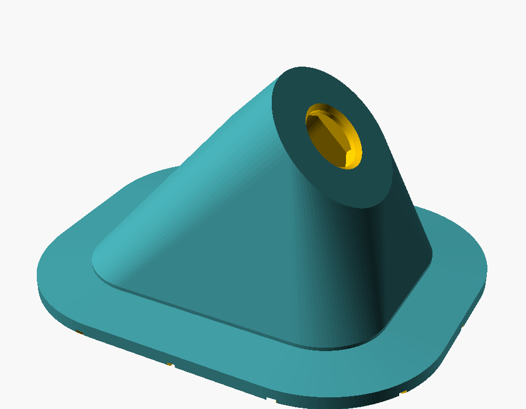
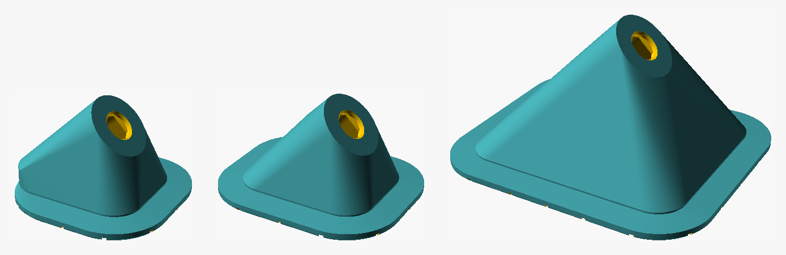
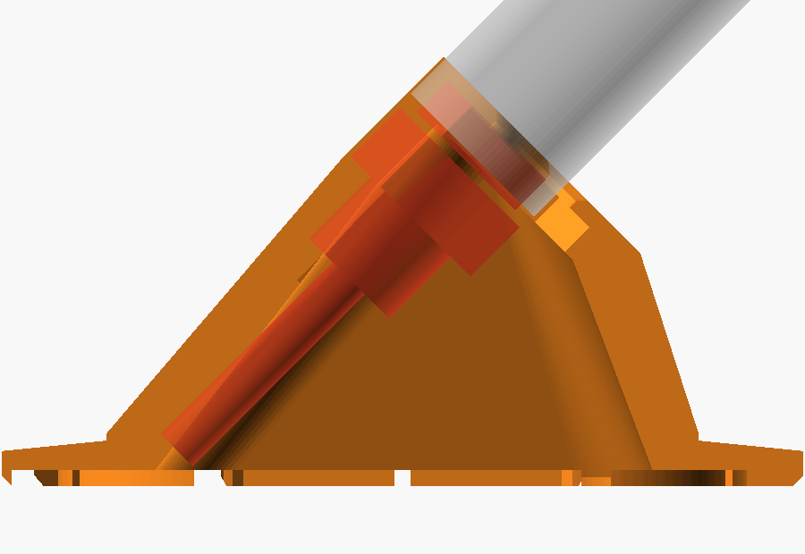
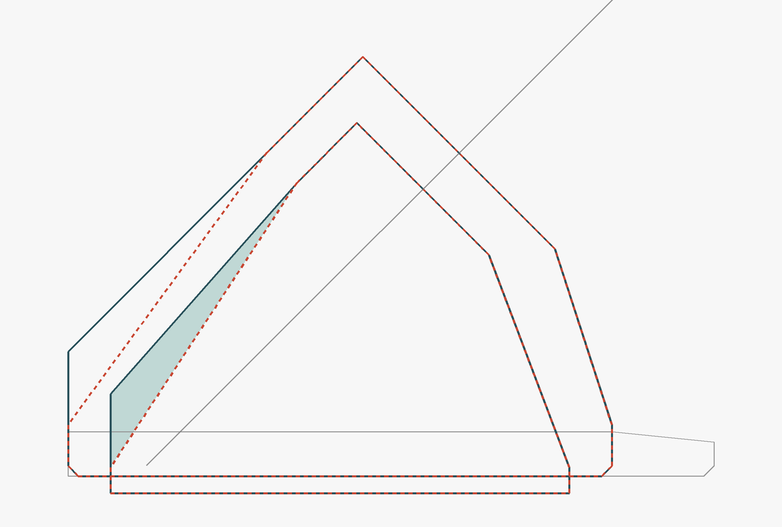
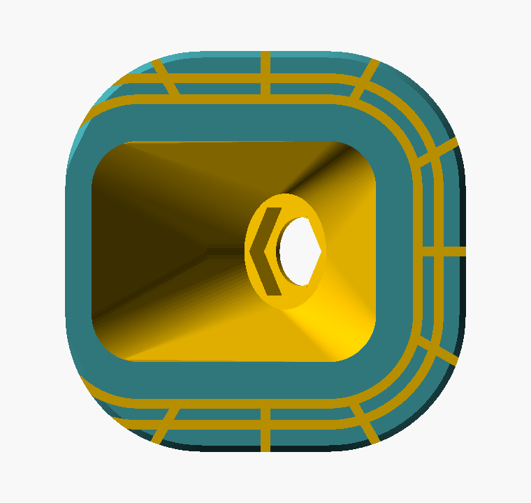
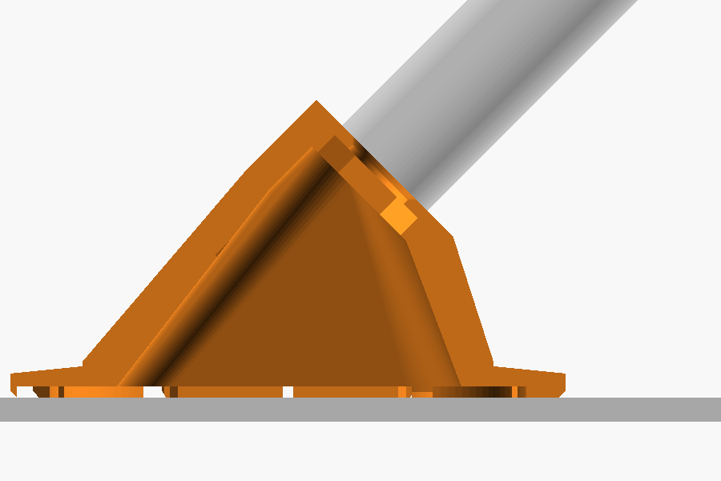
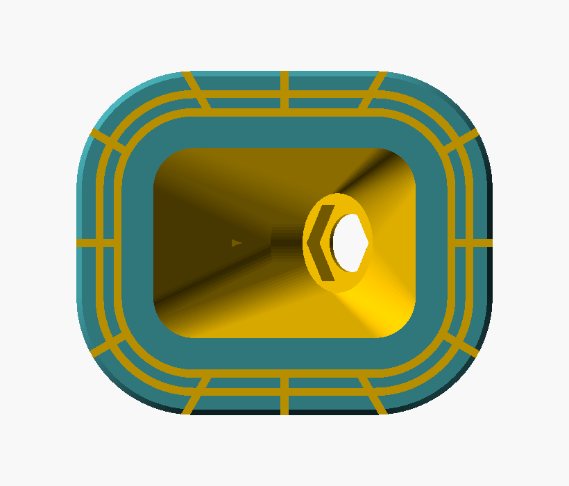

# SMA Hood — capuz de antena a 45°, colado com PU

Leva o conector **SMA fêmea de painel** para uma face inclinada a **45°** sobre a
parede externa da caixa hermética, sem cotovelo e sem adaptador de RF. A peça é
**toda fechada** — a única abertura é o furo do SMA — e é fixada **só com cola PU**,
por uma saia ranhurada que contorna a base. Nenhum parafuso, nenhum furo lateral.



> **boss**, no texto e no código (`boss_d`, `boss_x`, `boss_len`): é a **sede
> cilíndrica** do conector — o cilindro de Ø16 que sai do alto do cone e cuja face
> plana, perpendicular ao eixo da antena, recebe a arruela e a porca do SMA. Termo
> corrente de projeto mecânico para um ressalto cilíndrico que carrega um furo ou
> um assento.

## Três versões, o mesmo arquivo



| | Quadrada | Compacta | XL |
|---|---|---|---|
| Planta com a saia | **38 × 38 mm** | 46 × 38 mm | 66 × 58 mm |
| Altura total | 24,7 mm | 24,7 mm | 34,7 mm |
| Abertura inferior | 27 × 21 mm | 29 × 21 mm | 49 × 41 mm |
| Face de colagem | 693 mm² | 932 mm² | 1568 mm² |
| STL | `sma_hood_sq.stl` | `sma_hood.stl` | `sma_hood_xl.stl` |

Tudo o mais é idêntico nas três: mesmo conector, mesmos 45°, mesma parede de 2,5,
mesma saia de 6 mm com os 3,5 mm de selo contínuo, mesma proporção de colagem
(~73% de contato / 27% de ranhura).

**A XL** existe por um motivo de montagem: com 49 × 41 de abertura e mais 10 mm de
pé-direito, o dedo entra inteiro por baixo e segura o corpo do conector enquanto se
aperta a porca do lado de fora. Custa 66 × 58 mm de parede — mais da metade da
largura de uma tampa de 110 × 110 — e ~40% mais filamento.

**A quadrada** iguala o comprimento à **largura** (26), não ao comprimento (34): é a
menor pegada das três na caixa, e a única simétrica em planta. Ela troca a saia da
face posterior por profundidade interna — veja abaixo.

## A quadrada: base curta, e o que ela faz para compensar



Encurtar a base de 34 para 26 mm tira 4 mm de cada lado, e **o eixo do boss tem que
recuar junto** — em x = 8, com a borda da frente agora em x = 13, o boss ficaria
pendurado para fora da planta. Recuando os mesmos 4 mm (`boss_x` = 4), a parede da
frente sai **idêntica** à da retangular, 14° com a vertical; só a rampa de trás
encurta.

O problema que sobra é o espaço atrás do conector, e ele é maior do que parece se
você olhar só o eixo. O que aperta é o **diâmetro** do que passa ali — o sextavado
que sobra do rebaixo, o crimp, e só então o cabo. Medindo a folga a partir da face
interna do boss, por diâmetro:

| Folga para… | Base curta, crua | Parede recuada | **Como está** | Compacta |
|---|---|---|---|---|
| Ø9,7 (sextavado) | 6,2 mm | 8,1 mm | **15,3 mm** | 10,1 mm |
| Ø8 | 7,8 mm | 12,2 mm | **21,3 mm** | 16,8 mm |
| Ø6,5 (crimp) | 9,1 mm | 15,8 mm | **22,0 mm** | 22,0 mm |
| Ø2,6 (cabo) | 12,7 mm | 24,0 mm | **24,0 mm** | 24,0 mm |

Duas mudanças produziram essas colunas, as duas **sem tocar no contorno externo**, que
segue 38 × 38 × 24,7 mm:

**1. A parede posterior deslocada** (`back_gain` = 6). Ela avança 6 mm para dentro da
footprint da saia e **para exatamente onde a saia terminava**. A face da frente fica
fixa — o que se ganha de cavidade sai da saia, não da base. A abertura inferior vai de
21 × 21 para **27 × 21 mm**.

**2. A parede posterior em pé** (`back_wall_h` = 7,31). Em vez de a rampa começar na
própria aresta da base, a parede sobe **vertical, a 90° com a base**, até 7,31 mm, e só
dali o teto sai para o boss.



No perfil acima, o tracejado vermelho é o contorno anterior e o cheio é o atual; o
hachurado é o que a cavidade ganhou. A linha fina é o eixo da antena — e é aí que está
a graça: **7,31 mm é exatamente a altura em que o teto sai paralelo ao eixo.** O
corredor por onde saem a traseira do conector e o cabo desce a 45°; com o teto na mesma
inclinação, ele deixa de cortar o corredor. Por isso a folga para o sextavado quase
dobra (8,1 → 15,3) com um ganho de volume de só 12%.

Esse mesmo 45° é o **limite auto-suportado**: o teto é a face de baixo de um vão. Subir
a parede além de 7,31 deita o teto (9 mm já dá 42°) e passa a pedir suporte na
cavidade. Então 7,31 não é um número escolhido, é onde as duas restrições se encontram.

| Cavidade | Base curta, crua | Parede recuada | **Como está** | Compacta |
|---|---|---|---|---|
| Volume interno | 4 178 mm³ | 5 134 mm³ | **5 793 mm³** | 5 460 mm³ |
| Abertura inferior | 21 × 21 | 27 × 21 | **27 × 21 mm** | 29 × 21 mm |
| Altura do teto a x = −16 | 1,3 | 1,3 mm | **5,4 mm** | — |
| Altura do teto a x = −12 | 7,4 | 7,4 mm | **9,9 mm** | — |

A parede em pé sozinha vale **+659 mm³ (+13%)**, todo concentrado no terço traseiro:
+4,1 mm de altura de teto junto à parede de trás, caindo a zero na vertical do boss,
onde nada mudou. Somando as duas mudanças, a cavidade saiu de 4 178 para 5 793 mm³
(**+39%**) — e a quadrada passou a ter **mais volume interno que a compacta**, numa
pegada 8 mm menor.

O preço das duas mudanças está todo num lugar só: **a face posterior fica sem saia.** A faixa colada
daquele lado cai de 8,5 para **2,5 mm** — só o anel da própria parede, sem ranhura —
e a traseira é justamente o lado que o peso da antena tenta descolar. Vale porque a
conta é folgada: uma antena de 30 g com o centro de massa a ~40 mm põe naquela faixa
algo como **6 kPa** de tração, contra 1–2 MPa que o PU aguenta. As outras três faces
seguem com os 8,5 mm e o padrão completo de ranhuras.



Dá para ler na face de colagem: os dois anéis e os canais contornam a frente e as
laterais e **morrem nos cantos de trás**, onde a saia acabou. A faixa posterior é o
retângulo liso à esquerda, e o selo contínuo de 3,5 mm em volta da abertura segue
inteiro, dando a volta completa — ele é a barreira de água e não foi tocado.

Quem preferir a faixa de trás de volta usa `back_gain = 3` (fica 5,5 mm de faixa
colada atrás, o 1º anel de ranhura ainda cabe inteiro) e devolve 3 mm de cavidade.

## Cotas

| | Quadrada | Compacta | XL |
|---|---|---|---|
| Planta do corpo | 26,0 × 26,0 | 34,0 × 26,0 | 54,0 × 46,0 mm, canto R7 |
| Planta com a saia | 38,0 × 38,0 | 46,0 × 38,0 | 66,0 × 58,0 mm |
| Altura total | 24,7 | 24,7 | 34,7 mm |
| Centro da face do SMA | 19,0 | 19,0 | 29,0 mm |
| Recuo do eixo (`boss_x`) | 4,0 | 8,0 | 8,0 mm |
| Parede posterior (`back_gain`) | **6,0** | 0 | 0 mm |
| Saia na face posterior | **0** | 6,0 | 6,0 mm |
| Canais radiais na saia | 12 | 12 | 20 |

Comum às três:

| | |
|---|---|
| Inclinação | **45°** em relação à superfície colada |
| Face do SMA | Ø16,0 plana, perpendicular ao eixo da antena |
| Furo do SMA | Ø6,50, chanfro 0,5 na face externa |
| Rebaixo sextavado | 8,41 entre faces × 2,0 de profundidade, **voltado para dentro** |
| Parede | 2,5 mm no corpo; 3,0 mm na face do SMA |
| Saia | 6,0 mm de avanço, 2,6 → 2,0 mm de espessura, chanfro 0,6 na aresta |
| Passo dos canais radiais | ~10,5 mm — o número acompanha o perímetro |

As cotas do conector são as **mesmas medidas no flange do [Baton Node](../)**
(`wisblock_sled.scad`): mesmo SMA fêmea de painel, mesma técnica de travamento.

## Como funciona



O sextavado fica **por dentro**: o corpo do conector assenta no rebaixo e não gira
enquanto se aperta a porca do lado de fora — exatamente como no cap do cano. Sobra
**1,0 mm de furo redondo** na face externa, onde entram a arruela e a porca.

A montagem é feita **antes de colar**, com a peça na mão:

1. Furar a caixa **dentro da área da abertura** (27 × 21, 29 × 21 ou 49 × 41), com o
   próprio capuz servindo de gabarito: apoiar, contornar a parede interna a lápis,
   furar no meio da marca. **Ø5 basta** — veja a ordem de montagem abaixo.
2. Passar a **ponta IPEX** do pigtail pelo furo, de fora para dentro da caixa.
3. Enfiar o conector no capuz por baixo, encaixar o sextavado no rebaixo, e apertar
   arruela + porca por fora, **com PU sob a arruela**.
4. Colar o capuz.

> **A ordem importa.** Passando a ponta IPEX pelo furo, o furo da caixa só precisa
> deixar o **cabo** passar (Ø5). Se você tentar enfiar o conector já montado de
> dentro para fora, o furo tem que engolir o sextavado (Ø9,71 nas quinas), vira um
> Ø11 e você perde a folga que sobra para o PU vedar em volta do cabo.

> **Depois de colado, a cavidade do capuz vira parte do volume interno da caixa** —
> as duas se comunicam pelo furo do pigtail. A estanqueidade do conjunto passa a
> depender da vedação sob a arruela do SMA. Vede também em volta do cabo, no furo da
> caixa. Se a caixa tem válvula respiro PTFE, ela continua fazendo o trabalho para o
> volume somado.

## A saia



A face de colagem é uma faixa de **8,5 mm de largura** (2,5 da parede + 6,0 da saia)
contornando a peça, com **2 anéis** e canais radiais, todos de 0,9 × 0,9. Mesma
lógica do [WisMesh Foot](../wismesh-foot/): o PU cura dentro do sulco e trabalha como
rebite; os canais radiais deixam o excesso escapar em vez de formar bolha. A foto
acima é a compacta, com o padrão completo nas quatro faces.

**A diferença é que aqui a junta também veda.** Por isso a faixa mais interna — os
**3,5 mm** que envolvem a abertura — é **contato contínuo**, sem nenhuma ranhura
cruzando: é a barreira de água. Todos os sulcos ficam para fora dela, e os canais
radiais correm do primeiro anel **para a borda externa**, nunca para dentro.

Medido nos STLs:

| | Quadrada | Compacta | XL |
|---|---|---|---|
| Face de colagem | 693 mm² | 932 mm² | 1568 mm² |
| Contato | 514 mm² — **74%** | 673 mm² — **72%** | 1141 mm² — **73%** |
| Ranhura | 179 mm² (26%) | 258 mm² (28%) | 427 mm² (27%) |
| PU alojado | ~161 mm³ | ~232 mm³ | ~385 mm³ |

Os ~73% de contato são bem mais conservadores que os 39% do pezinho, de propósito:
esta junta faz três coisas ao mesmo tempo — colar, vedar e resistir ao **momento da
antena**, que numa haste a 45° é o esforço que realmente tenta descolar a peça. O
número de canais radiais acompanha o perímetro para manter o passo em ~10,5 mm, e é
sempre par, para a peça não sair assimétrica.

A saia é uma **rampa** (2,6 mm junto à parede, 2,0 na ponta) com chanfro de 0,6 na
aresta inferior externa: o chanfro vira reservatório para o cordão de PU que se passa
por fora, contornando a peça depois de assentada. Onde não há saia — a face posterior
da quadrada — o chanfro sai na própria aresta da parede.

## Gerar

```sh
openscad                 -o sma_hood.stl    sma_hood.scad
openscad -D xl=true      -o sma_hood_xl.stl sma_hood.scad
openscad -D square=true  -o sma_hood_sq.stl sma_hood.scad
```

Parâmetros que valem mexer:

| | |
|---|---|
| `square` | iguala o comprimento à largura (26 × 26 de corpo) |
| `xl` | +10 de altura, +20 na planta |
| `back_gain` | quanto a parede posterior avança para dentro da saia (0…`skirt_w`) |
| `grow_xy` / `grow_h` | os acréscimos da XL, para um tamanho intermediário |
| `boss_x` | recuo do eixo; mexer junto com a planta, veja a seção da quadrada |
| `tilt` | 45 → 30 ou 60, se quiser outra inclinação |
| `boss_d` | Ø da face plana — aumente se a base da sua antena for larga |
| `skirt_w` | avanço da saia; mais área de cola, peça mais larga |
| `show_antenna` | fantasma Ø10 × 60 para conferir a folga |

Para outro conector, medir e ajustar `sma_hole_d`, `sma_hex_af` e `sma_hex_dep`.

## Impressão

**PETG, ABS ou ASA** — fica no sol, exposto, e é PU colado. Evite PLA.

**Imprima sobre a face de colagem, sem suporte.** É a orientação certa por três
motivos: a face que precisa sair plana encosta no leito; a cavidade fecha em cúpula,
com as paredes inclinadas para dentro e nada de bridge; e o teto da cavidade, no
fundo do boss, é justamente o plano de 45°, que é o limite auto-suportado. As
ranhuras saem na primeira camada, como vãos rasos.

A superfície mais deitada é o teto de trás: **45° na quadrada, 52° na compacta, 50° na
XL.** As três imprimem sem suporte, mas a quadrada está **exatamente no limite** — o
teto foi levantado até ficar paralelo ao eixo da antena, e 45° é justamente o ângulo
que ainda se auto-suporta. Se o seu perfil tiver refrigeração fraca, olhe essa região
na primeira peça. Quem quiser margem baixa `back_wall_h` para 5 ou 6 (o teto volta
para ~48°) e devolve umas poucas centenas de mm³.

Perímetros: 3 ou mais. A parede é de 2,5 mm e o esforço aqui é de flexão na raiz do
cone — vale mais perímetro que preenchimento. 20–25% de infill.

Depois de imprimir, **passe a peça no plano** (lixa 220 sobre um vidro) antes de
colar: qualquer *elephant foot* na saia tira a peça de esquadro e a antena sai torta.
