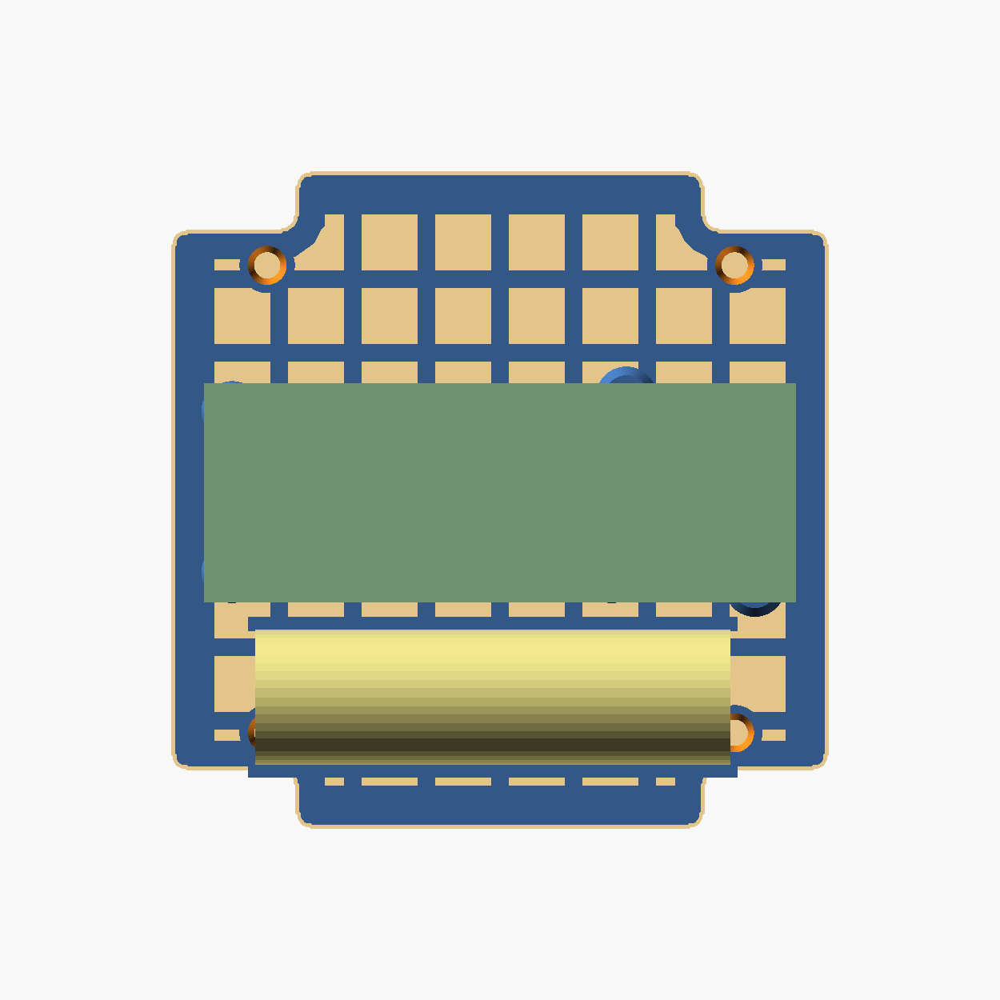

# WisMesh 1W Grid Tray — Rohdbox 110×110×60 IP68

Bandeja gradeada para montar o conjunto **WisMesh 1 Watt Booster**
(RAK19007 + RAK3400 + RAK13302) e duas células 18650 dentro de uma caixa
hermética Rohdbox de 110 × 110 × 60 mm.

A bandeja é parafusada **sobre** a `placa_laranja_gabarito`, com parafuso passante
até os pilares da caixa, e é toda vazada — braçadeiras de nylon passam por qualquer
vão, o que dispensa pontos de amarração dedicados.

Tamanho: **89 × 89 × 9 mm** (bandeja de 3 mm + torres de 6 mm).

O contorno **não é um quadrado**: os pilares de ar da caixa vão do fundo até a
tampa, e a placa laranja tem os quatro cantos recortados em **L** para desviar
deles. A bandeja reusa esse contorno, extraído do próprio
`placa_laranja_gabarito.stl` (92 pontos, tolerância de 0,12 mm) e recuado 0,5 mm.

## Gabarito de furos do conjunto WisMesh

Este é o dado que mais custou a levantar, então fica registrado. São **6 pontos**,
com furo de **2,3 mm** para o M2.5 cortar a própria rosca no plástico:

| # | x | y | Origem |
|---|---|---|---|
| 1 | 3,81 | 4,08 | RAK19007 (placa mãe) |
| 2 | 3,81 | 26,08 | RAK19007 |
| 3 | 55,81 | 4,08 | RAK19007 |
| 4 | 57,81 | 28,08 | RAK19007 |
| 5 | **75,40** | **2,20** | extensão RAK13302 |
| 6 | **75,40** | **23,20** | extensão RAK13302 |

Duas armadilhas aqui:

- **A extensão não está alinhada com a placa mãe.** Os furos do RAK13302 ficam em
  y = 2,2 e 23,2 (span 21 mm), cerca de 1,9 mm abaixo dos y = 4,08 / 26,08 da
  RAK19007. Não é um retângulo contínuo de 6 furos.
- **O padrão da placa mãe não é simétrico**: o quarto furo é (57,81; 28,08), não
  (55,81; 26,08) como a simetria sugeriria.

Procedência: os furos 1–4 vêm do modelo oficial do RAK19007 e foram validados numa
peça já impressa e montada. Os furos 5–6 foram confirmados em **três modelos
independentes** de terceiros feitos para este mesmo conjunto (`adapter3`,
`341board`, `carlon-v6`), que concordam em x = 75,0–75,5 e span 21,0 mm.

> Atenção a uma divergência na documentação da caixa, que informa "26 mm centro a
> centro no eixo Y, recuados 2,0 mm". Furos com esse padrão existem na RAK19007,
> mas têm **Ø2,14** — são pequenos para M2.5. Os de montagem são os Ø2,70, com span
> de 22 mm. Usar 26 mm faria os parafusos não coincidirem.

## Fixação na caixa

4 furos Ø3,6 em quadrado de **64 × 64 mm**, coincidentes com os Ø3,45 da placa
laranja (que estão em 18/82 no sistema dela).

4 furos Ø3,6 em `13,125` e `77,125` (medidos do canto da laranja, cujos furos estão
em 18 e 82).

A posição da PCB foi **escolhida por busca** sobre o contorno real, verificando duas
coisas em cada candidata: que as seis torres caem sobre material (não nos recortes
dos cantos) e que nenhuma invade o reforço de um furo de fixação. Em `pcb = (4,5;
31)` a torre mais próxima de um furo fica a **20,4 mm** — folga larga.

Os furos de y = 13,125 ficam sob o pack de baterias, então levam **rebaixo de
6,2 × 2,0 mm**: a cabeça do parafuso fica sob a superfície e não empurra a célula.
Os de y = 77,125 ficam livres acima da PCB.

### Por que o pack fica empilhado

Os recortes dos cantos custam área: nas faixas laterais (x < 17 e x > 73) o material
só existe entre **y = 8 e 82**, ou seja 74 mm úteis em vez de 90.

Com as duas células **lado a lado** (38 mm) mais a PCB (30 mm), sobram 6 mm de gap, e
nesse aperto o furo de fixação de (77,125; 77,125) cai no caminho da torre da
extensão. Varrendo todas as combinações de posição e reforço, só duas soluções
apareciam — ambas exigindo reforço de 1,0 mm, menor que a cabeça de um M3 (Ø6), que
passaria a apoiar sobre a grade vazada.

Com o pack **empilhado** (18,6 de largura × 37,2 de altura) o consumo em Y cai para
20 mm, a folga sobe para 13,6 mm e o problema desaparece. As guias laterais têm 6 mm
de altura, porque um pack estreito e alto tomba com facilidade.

## Ordem de montagem

Importa, porque a bandeja fica sob os componentes:

1. Parafusar a bandeja na placa laranja / pilares da caixa (4 × M3)
2. Parafusar o WisMesh nas 6 torres (M2.5, rosca direta)
3. Assentar o par de 18650 entre as guias e amarrar com braçadeiras pelos vãos

## Câmara de ar

A documentação da caixa exige **≥8 mm** livres sob a placa, para os pinos de solda
não tocarem o plástico e para dissipar o calor do amplificador de 1 W. Aqui:
placa laranja 2,5 + bandeja 3,0 + torre 6,0 = **11,5 mm**.

## Parâmetros

| Parâmetro | Valor | Notas |
|---|---|---|
| `grid_inset` | 0,5 | recuo em relação ao contorno da placa laranja |
| `tower_h` | 6,0 | altura livre sob a PCB |
| `tower_id` | 2,30 | rosca direta M2.5 |
| `fix_span` | 64,0 | quadrado de fixação da caixa |
| `n_cell` | 8 | vãos por lado; o vão (7,68 mm) é calculado para fechar exato |
| `bar_w` | 2,4 | largura da barra da grade |
| `bat_l` / `bat_w` | 67 / 20 | pack empilhado, em y 8..28 |
| `bat_rail` | 6,0 | altura das guias laterais do pack |

## Impressão

Mesma recomendação do sled: **PETG, ABS ou ASA** — a caixa é hermética e fica no
sol. Assenta plana no leito, sem suporte. As torres imprimem na vertical.
