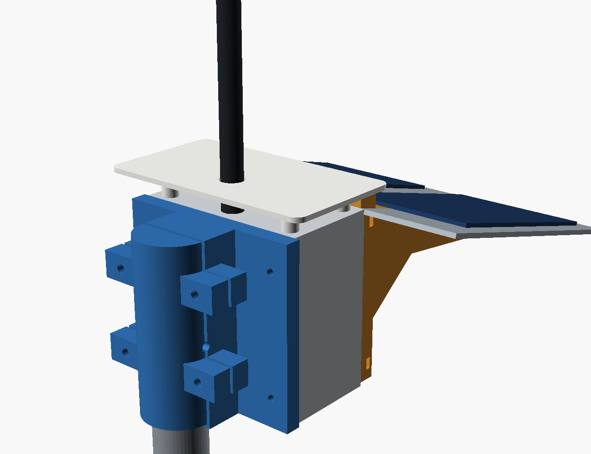
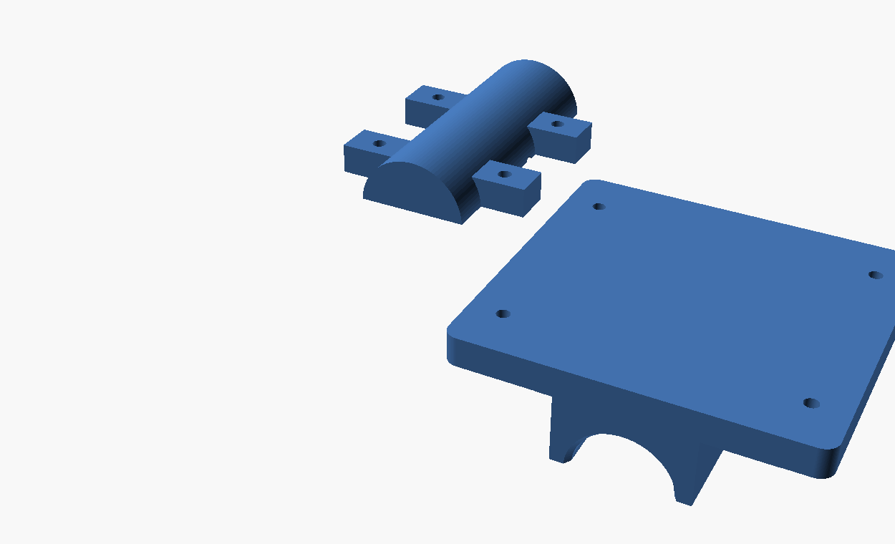
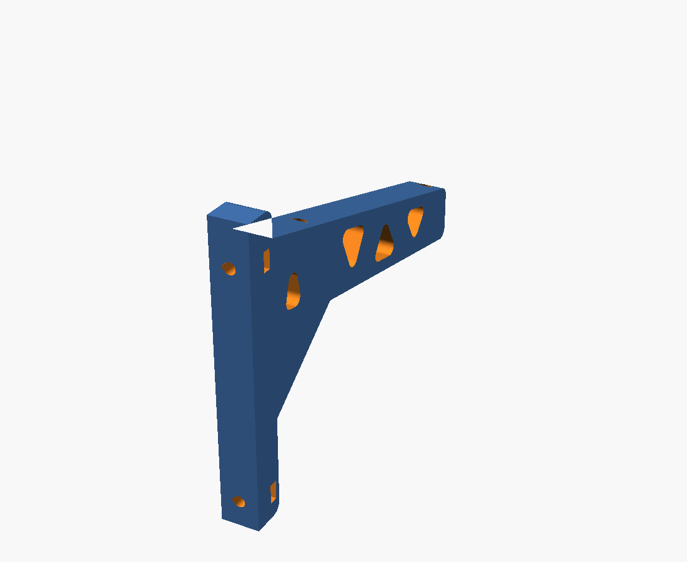
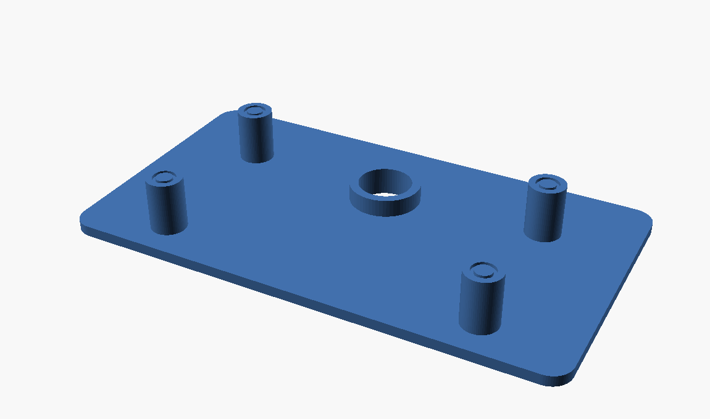
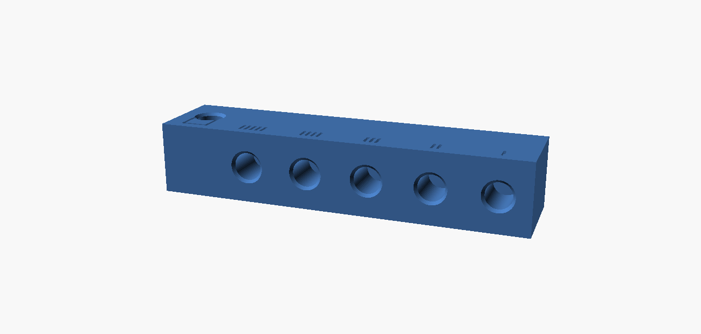

# WisMesh no poste — caixa em pé, Manaus

Fixação do conjunto WisMesh 1 W (caixa Rohdbox 110×110×60 IP68) na **extremidade
superior** de um tubo de ferro **Ø31,7 × 1,7 mm**, de 6 m, vertical e estaiado.
A caixa fica **em pé ao lado do topo do poste**, com a face superior no nível da boca
do tubo — a antena sai dali, vertical, sem poste ao lado dela. A chapa de alumínio com
os dois painéis solares vira uma **aba a 15°** na face frontal.



**Três peças impressas.** A chapa e os painéis são compra e usinagem manual.

```
   berço (2 metades)  →  poste  →  caixa  →  suporte em L (2)  →  chapa  →  painéis
                                      ↑
                                   chapéu
```

## As duas famílias de furos da caixa

A Rohdbox tem furos passantes nas duas faces grandes, **ambos fora do anel de
vedação** (quem fecha a caixa é a trava lateral em clipe). Cada uma fixa uma coisa:

| Face | Gabarito | Ø | Fixa |
|---|---|---|---|
| **Fundo** | **93 × 74** (retângulo) | ~4,3 | o berço → poste |
| **Tampa** | **90 × 90** (quadrado) | ~7,5 | os suportes em L → chapa |

O 93 × 74 vem de uma cota **gravada na peça pelo fabricante**, conferida por
fotogrametria: razão medida 1,2588 contra 93/74 = 1,2568, com as escalas derivadas de
cada cota batendo entre si a **0,16%** — prova de que descrevem o mesmo retângulo.
O 90 × 90 e a tampa de 102,6 são paquímetro.

---

# Berço de face vertical · `berco_vertical.scad`



**Duas metades diferentes:** `half=0` leva a placa, `half=1` é a contra-peça.

| | |
|---|---|
| Furo do poste | Ø31,9 (0,2 de folga sobre os 31,7 medidos) |
| Parede / corpo | 6 mm → Ø43,9 |
| Pega | **110 mm** nas duas metades |
| Placa de fixação | 116 × 110 × 10, **cantos R5**, gabarito 93 × 74, Ø4,5 |
| Material além do furo | 9,25 mm |
| Fechamento | 4 × M5 × 40 + nyloc |
| Passante no poste | Ø5,2, no plano de partição |

## O alojamento é cego, e isso resolve três coisas

O tubo entra por baixo e **o rebordo encosta no teto**:

1. **Água.** Seis metros de tubo aberto em pé é calha de chuva. Tampado, acabou.
2. **Estabilidade em Z.** O conjunto **apoia** em vez de depender de atrito:
   **160 mm²** de coroa, 0,09 MPa com o peso montado — não flui nem a 60 °C.
3. **Montagem.** A altura sai sozinha: enfie até bater.

> **As duas meias-luas têm o mesmo comprimento.** Não tinham: o corpo parava em
> −106 enquanto a espinha e a placa iam a −110, e como o furo do poste é cortado
> **através** delas, a metade com placa ficava com **104 mm** de canal contra **100**
> da outra. Agora `body_z0 = plate_z0`, e as duas têm 104.

> **O corte do furo comeca em `plate_z0`, nao em `body_z0`.** A espinha e a placa
> descem 4 mm alem do corpo; cortando so' a partir do corpo, sobravam **3 mm
> entupindo a boca** do alojamento e o tubo nao entrava. Conferido por intersecao
> com um cilindro Ø31,7: as faixas de entrada e de trabalho dao vazio, e o unico
> contato que resta e' o plano z = −6 — que e' o batente.

O passante M5 deixa de segurar peso e passa a cuidar só de **rotação e arranque**.
O arranque é real: a 40 m/s a chapa inclinada gera ~45 N de sustentação contra 15 N
de peso, sobrando 30 N puxando para cima. Ele fica **no plano de partição**, meia
canaleta em cada metade — assim não atravessa a placa de fixação.

Cordão de silicone na junta de cima, onde o tubo encontra o berço: a folga anular de
0,1 mm puxa água por capilaridade.

---

# Suporte em L · `suporte_L.scad`



**São dois**, parafusados nos furos de canto da tampa.

| | |
|---|---|
| Largura | **15 mm** (era 12) |
| Perna | 14 mm de espessura, de z = −110 a +7 |
| Braço | alcança 150 mm à frente da tampa |
| Seção na raiz | **34 × 15** → módulo resistente **2890 mm³** |
| Seção na ponta | 15 × 15 |
| Mísula no canto interno | 38 mm |
| Alívio em treliça | 4 rasgos, banzos de 5, diagonais de 6, cantos R3 |
| Tensão a 40 m/s | **0,64 MPa** |
| Insertos M4 8×6 | a 45 e 150 mm ao longo da rampa |
| Fixação na tampa | porca M4 aprisionada, bolsa lateral |

### A treliça

Ela **fica mais rígida que a peça maciça** abaixo de ~32% de preenchimento — os
perímetros dos furos densificam o banzo, que é a fibra extrema. Aos 20% do perfil
estrutural o ganho é de **+8%**. Aos 30% empata.


A alma de uma viga em balanço carrega pouca flexão — a tensão é máxima nas fibras
extremas e **zero na linha neutra**. Tirar material do meio custa quase nada:

| | maciço | com treliça |
|---|---|---|
| Tensão máxima | 0,65 MPa | **0,89 MPa** |
| Cisalhamento na alma | 0,049 MPa | 0,14 MPa |
| Volume **de modelo** | 90 112 mm³ | 82 021 mm³ (−9%) |
| Material **depositado** | — | **+1,2 cm³** |

Contra ~25 MPa do ASA a 60 °C: **fator 28 de folga**.

> **A treliça não economiza filamento — ela gasta mais.** Os −9% são volume de
> modelo. O que sai de lá estava a 36% de densidade e valia ~4,0 cm³ de material;
> os quatro furos acrescentam **5,2 cm³** de anel de perímetro novo. Saldo: **+1,2 cm³**.
> É a mesma densificação do banzo que aparece como ganho de rigidez, vista pelo
> outro lado. Ela se paga em **rigidez e estética**, não em material nem em tempo.

**Não é pelo vento.** A silhueta do suporte inteiro dá 6 N a 40 m/s, então vazar
metade economiza 3 N contra os 50 N da chapa — e ele fica na esteira dela. É por
estética, material e tempo.

Três coisas foram deliberadas:

- **A raiz fica maciça** (y = 108 a 112 e 129 a 150). É onde o momento é máximo.
- **Nenhum rasgo encosta num inserto.** O arquivo confere sozinho e imprime
  `*** COLIDE COM RASGO ***` no console se alguém mexer nas cotas e criar o conflito.
- **A mísula não leva rasgo.** O raio inscrito do triângulo dela é 10,9 mm: qualquer
  recuo útil a colapsa, e ela é justamente quem reforça o canto.

Cantos em **R3**, nunca vivos — canto vivo é iniciador de trinca em peça impressa.

Os rasgos atravessam a espessura, que é a direção de construção: saem como furos
verticais na impressão, sem ponte e sem suporte.

### A bolsa da porca

| | |
|---|---|
| Porca M4 DIN 934 | 7,00 entre faces × 3,20 |
| Bolsa | **7,45 × 3,55** — folga 0,45 / 0,35 |
| Profundidade | pelo **entre vértices** (8,53), não pelo entre faces |
| Teto | chanfro a 45° fechando até 1,4 mm, com 2,16 mm de material acima |

Três coisas não óbvias, todas pela orientação de impressão:

- **A folga de 0,20 que eu tinha posto não passa.** Rasgo pequeno imprime 0,1 a 0,2
  subdimensionado em FDM, então a folga real cairia para zero. 0,45 é o mínimo
  seguro, e mesmo assim a porca só gira 19° antes do vértice travar na parede.
- **A profundidade é ditada pelo entre vértices.** As faces da porca apoiam nas
  paredes de 7,45; o que aponta para o fundo é um **vértice**.
- **O teto da bolsa é chanfrado, não plano.** Deitada, a bolsa abre para o leito e
  fecha lá em cima: teto plano de 3,55 seria ponte, e com a ventoinha em zero — que
  o ASA exige — não há como resfriar. O chanfro a 45° fecha sozinho.

O arquivo confere e imprime `*** TETO FINO ***` se alguém mexer nas cotas e deixar
menos de 2 mm de material acima do ápice.

### Teardrop, e só nos furos de passagem

Deitada, a peça tem dois tipos de furo **horizontal**: os Ø4,5 de passagem e os
Ø5,60 dos insertos. Furo horizontal fecha com ponte e sai achatado.

- **Ø4,5 de passagem: teardrop.** Sai de graça — o parafuso não se importa com a
  forma, e tira a barriga que poderia prendê-lo. Ápice a r·√2, flancos a 45°.
- **Ø5,60 dos insertos: ficam redondos.** O `cupom_horizontal.stl` existe justamente
  para medir quanto a ponte fecha esse furo; mudar a forma agora invalidaria a
  medição. E o teardrop tira exatamente o plástico que o serrilhado do inserto
  precisa para morder.

**Porca aprisionada e não inserto:** o furo da tampa é Ø7,5 e o parafuso vem de dentro
da caixa. A parede que sobraria em volta de um inserto de latão nesse diâmetro não
aguenta a prensagem.

## Onde a aresta da chapa fica, e por quê

**y = 94, z = 0** — encostada no canto superior da parede frontal e **no nível da base
do conector SMA**.

| Posição da aresta | absorvido na parede frontal | distância à antena |
|---|---|---|
| Sem chapa | 2,76 W | — |
| **y = 94, z = 0** | **2,12 W** | 0,148 λ |
| y = 110, z = 0 (vão de 16 mm) | 2,39 W | 0,197 λ |
| y = 94, z = +8 | 2,12 W | 0,154 λ, **com metal acima da alimentação** |

Nenhum metal acima da base da alimentação — é isso que separa plano de terra de
refletor assimétrico. E a sombra fica no melhor caso possível: medi que uma aba satura
em ~100 mm de avanço; além disso o que sobra é **difusa do céu**, que nenhuma aba
bloqueia.

**A chaminé não se perde com a chapa encostada.** O ar corre entre a face de cima
(z = 0) e o chapéu (z = +15); a chapa fica **abaixo** desse canal e desce indo para a
frente, então a saída vira um bocal divergente.

---

# Chapéu da face superior · `chapeu.scad`



| | |
|---|---|
| Teto | 140 × 78 × 3 |
| Folga sobre a caixa | 15 mm |
| Beiral | 15 lateral, 15 atrás, **3 na frente** |
| Pés | 4 × Ø10, colados com PU, com ranhura de 0,9 |
| Furo da antena | Ø15, com saia de 5 mm virada para baixo |

**Por que ele existe.** A 3° do equador o sol passa a pino, e a face horizontal recebe
**2,3× mais por metro quadrado** que qualquer parede:

| Face de cima | absorvido no pico |
|---|---|
| Exposta | **3,46 W** |
| Sob chapéu **claro** | **0,23 W** |
| Sob chapéu preto | 1,15 W |

> **Imprima em branco ou cinza claro.** Preto absorve 11 W, chega a 67 °C e devolve
> cinco vezes mais radiação para a caixa — onde estão as 18650.

A chapa de alumínio não pode fazer este serviço: ficaria em volta da base da antena.
**Plástico é transparente para RF** e pode.

**O beiral da frente é só 3 mm, de propósito.** O chapéu fica 15 mm acima da face de
cima e o painel começa logo à frente, 7,8 mm abaixo. Cada milímetro de beiral frontal
projeta ~1,3 mm de sombra sobre o painel com o sol a 40° — e painel sem diodo de
bypass perde de 30 a 70% com uma célula sombreada. Trocar 0,27 W de calor por isso
seria péssimo negócio.

---

## A chapa (compra e usinagem sua)

**230 × 185 × 3 mm, alumínio nu.** Não pinte: a face de baixo nua (ε = 0,05) entrega
**0,041 W** de radiação para a caixa; pintada de branco entregaria **0,679 W** — 16×
mais. E não pintar a de cima custa 0,26 Wh/dia sobre 12,2.

Os dois painéis lado a lado, cada um com os 142 mm no sentido do caimento, com **30 mm
de margem na aresta de trás** — é essa margem que mantém o painel fora da sombra do
chapéu até ~41° de altura solar.

| Furação | |
|---|---|
| Suportes | 4 × Ø4,5, alinhados com os insertos (45 e 150 ao longo da rampa) |
| Painéis | 2 janelas p/ as caixinhas de junção + 8 alívios das cabeças salientes |

**Use inox A2 em todo o conjunto.** Não é só corrosão: 4 × M4 de aço carbono conduzem
**1,51 W** para a caixa contra **0,48 W** do inox — 37 vezes a radiação da chapa nua.
É o item térmico número um.

## Os 15°

Calculado para Manaus (3,1° S), céu com 50% de difusa: os 15° perdem **1,9%** na média
anual e **ganham 1,8% no mês pior**, que é quem dimensiona a bateria. A 15° o rumo
quase não importa — errar o norte em 45° custa 0,43%. A inclinação real é pela
**limpeza**: abaixo de 10° a poeira assenta e, em Manaus, o limo pega.

## Impressão

**Bico limitado a 240 °C** — o piso do ASA. A CP2 é **fechada**, e câmara aquecida
vale mais que 20 °C no bico para a adesão entre camadas. Ainda assim, as três peças
estão orientadas para **a carga nunca atravessar camada**:

| Peça | Orientação | Suporte |
|---|---|---|
| Suporte em L | **deitado de lado**, o perfil do L no plano do leito | não |
| Berço | **deitado sobre a face de partição** | não |
| Chapéu | de cabeça para baixo, teto no leito, pés para cima | não |

No suporte em L a flexão do braço trabalha **dentro** da camada, e o canto interno do
L — a concentração de tensão — fica inteiro numa camada só. É a peça em que isso mais
importa.

Os arquivos já saem na posição de impressão (`print_ready = true`).

### O berço vai deitado, não em pé

Corrigido depois de olhar no fatiador. **Em pé as orelhas de aperto ficariam em
balanço** — blocos de 12 mm com nada embaixo. Deitado sobre a face de partição:

- as orelhas assentam no leito
- a altura cai de **110 para 33 mm**
- a placa de fixação fica deitada, então a flexão dela (peso da caixa e vento na
  chapa) trabalha **dentro** da camada — que é o que importa com o bico em 240 °C
- o alojamento do poste vira um **arco auto-sustentado**, fechando progressivamente

Espere um pouco de barriga na chave do arco. Não atrapalha: quem aperta é o parafuso
e sobram 2 mm de folga entre as metades. Se ficar raspando no tubo, é lixa.

As duas metades cabem **no mesmo leito**: 116 + 80 = 196 mm de largura por 110 de
profundidade, contra os 200 × 148 da CP2. É apertado — separar em duas impressões é
mais seguro.

Todas cabem na mesa da CP2 (200 × 148):

| | dimensões |
|---|---|
| `berco_0.stl` | 116 × 110 × 33 |
| `berco_1.stl` | 80 × **110** × 21 |
| `suporte_L.stl` | 150 × 117 × 15 |
| `chapeu.stl` | 140 × 78 × 18 |

## Antena

**14 cm, 40 g, direto no bulkhead** da face superior. O momento de vento é de
**0,084 N·m a 30 m/s** contra ~1 N·m de torque de montagem de um SMA — fator 12.

> Os "10 dBi" do anúncio não existem. Em 923 MHz, meia onda são **162 mm**; com 140 mm
> a antena é uma meia onda e o teto físico é **2,15 dBi**. Para 10 dBi seriam ~8
> elementos empilhados, 1,3 m. Espere 2 a 3 dBi. O lado bom é que o lóbulo vertical
> fica largo (~30°), e o nó perdoa poste torto e vizinho em cota diferente.

**Confira se é SMA ou RP-SMA** antes de comprar o pigtail: rosca interna com **furo**
no miolo é SMA; com **pino**, é RP-SMA. São incompatíveis.

## Se sobrar dúvida de RF

A chapa fica a **0,148 λ** da antena. Todo o metal está no nível ou abaixo da
alimentação, que é o que importa — mas não dá para prever a magnitude do acoplamento
sem medir. Se um dia você puser um NanoVNA nisso e o SWR estiver puxado, o remédio já
está identificado: um **prolongador de SMA de 35 mm** sobe a alimentação e joga a
chapa claramente para baixo dela (0,148 → 0,224 λ). Peça pequena, acrescentável
depois, **sem mexer em mais nada** do conjunto.

## Cupom de inserto — este projeto pede o HORIZONTAL



O cupom do [`pu-rail`](../pu-rail/) tem os furos **verticais**, que é a condição
daquela peça. Aqui não serve: **o suporte em L imprime deitado e o furo do inserto
sai com o eixo paralelo ao leito.** Furo horizontal fatia em cordas, não em
circunferências, e o topo sai em ponte — achatado e um pouco menor.

`cupom_horizontal.scad` reproduz a condição real:

| | |
|---|---|
| Eixo do furo | **7,5 mm** do leito = meio da espessura do suporte |
| Altura da barra | **15 mm** = espessura do suporte |
| Material acima da ponte | 4,6 mm, igual ao da peça |
| Profundidade | 9,0 (8 do inserto + 1 de alívio) |
| Barra | 78 × 18 × 15 |

Cinco furos de 5,40 a 5,80 com **1 a 5 tracinhos** (1 traço = 5,40) e, na ponta, um
furo **vertical** de 5,60 marcado com um **quadrado** — a referência. Se o vertical e
o de 3 traços assentarem igual, a orientação não importa; se não, vale o horizontal.

Imprima com o **mesmo material, mesma camada e mesmo perfil** do suporte.

> O parafuso continua precisando de **2,5 mm de calço** sob a cabeça (chapa 1,5 +
> arruela 1,0). O furo tem 9,0 e um M4 × 10 encostaria no fundo, empurrando o inserto
> para fora — e você condenaria um furo bom.

## Ordem de montagem

1. Assentar os insertos nos suportes (**furo validado no cupom** do `pu-rail`)
2. Colar os painéis na chapa com silicone de **cura neutra** (nunca acético)
3. Bulkhead SMA na face superior, a 12 mm da borda de trás
4. Colar o chapéu com PU nos 4 pés
5. Parafusar os suportes na tampa: M4 **por dentro da caixa**, subindo pelo furo Ø7,5
   até a porca aprisionada
6. Parafusar a chapa nos insertos (4 × M4 × 12 inox A2)
7. No poste: enfiar as duas metades do berço **até o tubo bater no teto**, furar o
   tubo, cravar o M5 passante, fechar com os 4 × M5 × 40
8. Parafusar a caixa na placa do berço (4 × M4, cabeça por dentro da caixa)
9. Ligar os dois painéis **em paralelo**, com um Schottky em cada perna

## Gerar

```sh
openscad -D half=0 -o berco_0.stl   berco_vertical.scad
openscad -D half=1 -o berco_1.stl   berco_vertical.scad
openscad            -o suporte_L.stl suporte_L.scad
openscad            -o chapeu.stl    chapeu.scad
```

| Parâmetro | Peça | Notas |
|---|---|---|
| `pole_d` | berço | **meça o seu tubo** |
| `box_x` / `box_z` | berço | 93 × 74, gabarito do fundo |
| `ins_d` | suporte | **confira no cupom** antes dos definitivos |
| `arm_d0` | suporte | seção na raiz — é o reforço |
| `ang` | suporte | caimento; 15° por limpeza, não por geometria |
| `bei_fre` | chapéu | beiral da frente — cada mm vira sombra no painel |
| `print_ready` | todas | false mostra na posição montada |
