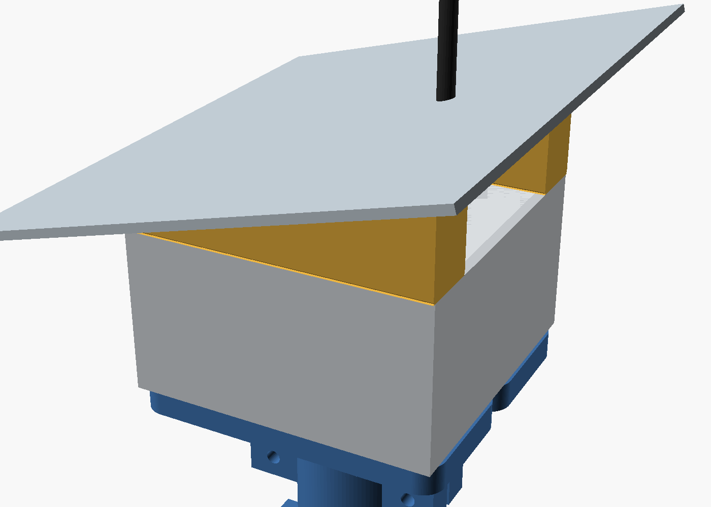
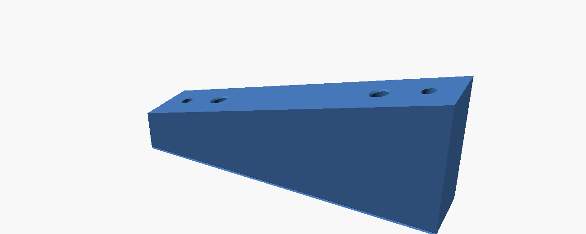
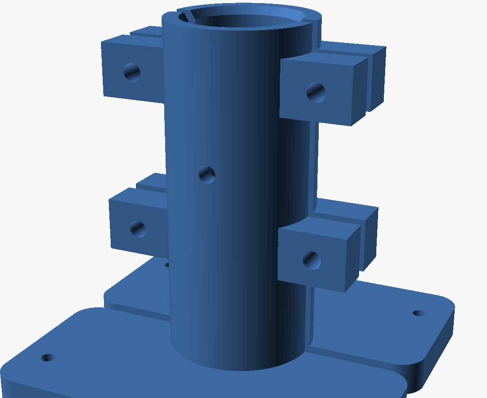

# WisMesh no poste — Manaus

Fixação do conjunto WisMesh 1 W (caixa Rohdbox 110×110×60 IP68) no topo de um
**tubo de ferro Ø31,7 × 1,7 mm**, de 6 m, vertical e estaiado, com **dois painéis
solares de 142 × 88 mm** colados numa chapa de alumínio inclinada a 15°.



Duas peças impressas. A chapa e os painéis são compra e usinagem manual.

```
   berço (×2, idênticas)  →  poste  →  caixa  →  trilho-cunha (×2)  →  chapa  →  painéis
```

## A decisão que organiza tudo: a caixa fica EM CIMA do poste

A antena vai na tampa da caixa, não no topo do poste. Como o poste não precisa
continuar para cima, a caixa pode ficar **centrada sobre ele** em vez de pendurada
ao lado — e isso muda a ordem de grandeza do problema:

| | caixa ao lado do poste | **caixa sobre o poste** |
|---|---|---|
| Braço de alavanca | 76 mm | **0** |
| Momento na prateleira | 4,5 N·m | ~0,6 N·m por quadrante |
| Prateleira | balanço nervurado | placa apoiada no centro |

De brinde, a prateleira **tampa a boca do tubo** — num poste de 6 m em pé isso é
entrada de água garantida.

## Os dois gabaritos da caixa

A Rohdbox tem furos passantes nas duas faces, **ambos fora do anel de vedação**
(quem fecha a caixa é a trava lateral em clipe). Cada face fixa uma coisa:

| Face | Gabarito | Ø | Fixa |
|---|---|---|---|
| **Fundo** | **93 × 74** (retângulo) | ~4,3 | o berço → poste |
| **Tampa** | **90 × 90** (quadrado) | ~7,5 | os trilhos → chapa |

O 93 × 74 vem de uma cota **gravada na própria peça** pelo fabricante. Conferido por
fotogrametria: razão medida 1,2588 contra 93/74 = 1,2568, e as escalas derivadas de
cada uma das duas cotas batendo entre si a **0,16%** — o que prova que as duas
descrevem o mesmo retângulo, e não pares de furos diferentes.

O 90 × 90 e a tampa de 102,6 são paquímetro. A fotogrametria tinha estimado
92,9 × 91,4 — **2 a 3% para mais**. Serviu para dizer que o padrão era quadrado e da
ordem de 90; não serviria para cortar peça.

---

# Trilho-cunha · 2 peças



**110 × 22 mm, de 15,0 a 44,5 mm de altura.** Assenta na tampa, recebe a chapa.

| | |
|---|---|
| Furos para a tampa | 2 por trilho, a ±45 mm (90 entre eixos), Ø4,5 |
| Porca aprisionada | M4, bolsa lateral 7,2 × 3,4, a 5 mm da base |
| Insertos para a chapa | M4 8×6 a ±30 mm, **perpendiculares à face de 15°** |
| Desnível | 29,47 mm sobre 110 = 15,00° |
| Material sob o inserto de montante | 12,4 mm |

**Por que porca aprisionada e não inserto nos furos da tampa:** o furo da tampa é
Ø7,5 e o parafuso entra por dentro da caixa. A parede que sobraria em volta de um
inserto de latão nesse diâmetro não aguentaria a prensagem. A porca M4 numa bolsa
lateral resolve sem peça especial.

O trilho transborda 3,7 mm da borda da tampa nas quatro pontas, de propósito: a água
que escorre da chapa pinga **para fora** da tampa, não sobre ela.

> As bolsas da porca abrem numa só face. Monte os dois trilhos com as bolsas
> **voltadas para fora**, senão a porca do trilho de dentro fica inacessível.

## O vão de ar sai divergente

| Posição | vão tampa → chapa |
|---|---|
| Borda baixa da chapa | 7,6 mm |
| Borda da caixa (entrada) | **15,0 mm** |
| Centro | 29,7 mm |
| Onde vai o SMA (x = +32) | **38,3 mm** |
| Borda alta | 51,8 mm |

Duto que abre no sentido da subida — a chaminé puxa sozinha. E o SMA fica no terço
alto porque é lá que cabe o conector mais a porca do chicote; no terço baixo o vão é
de 15 mm e não caberia.

---

# Berço do poste · 2 peças idênticas



Aperta os 100 mm finais do tubo e apresenta a prateleira com o gabarito do fundo.

| | |
|---|---|
| Furo do poste | Ø31,9 (0,2 de folga sobre os 31,7 medidos) |
| Parede / corpo | 6 mm → Ø43,9 |
| Pega | 100 mm (3× o diâmetro do tubo) |
| Prateleira | 112 × 52 × 10 por metade → **112 × 104** montada |
| Furos da caixa | 93 × 74, Ø4,5, com 7,25 mm de material até a borda |
| Fechamento | 4 × M5 × 40 + nyloc |
| Passante no poste | Ø5,2, a 60 mm da prateleira |

**Duas metades idênticas** — imprima o mesmo arquivo duas vezes. E duas metades, e não
um C único: o poste de 6 m já vai estar em pé, e um C de 300° em ASA não flexiona o
bastante para entrar de lado sem trincar.

**O passante no poste não é opcional.** Aperto de plástico relaxa no calor: a
pré-carga cai, o atrito some e um dia o conjunto desce ou gira. Furar o tubo (parede
de 1,7 mm, furo trivial) e cravar um M5 transforma isso em cisalhamento no aço.

O arquivo já está **na posição de impressão** — prateleira no leito, corpo subindo,
sem suporte. Montado, fica de cabeça para baixo em relação ao desenho.

---

## A chapa (compra e usinagem sua)

**200 × 165 × 3 mm, alumínio nu.** Os painéis colados lado a lado, cada um com os
142 mm no sentido do caimento, os dois com a borda de cima alinhada na borda alta —
assim nenhum painel recebe a água do outro.

Furação: 4 × Ø4,5 alinhados com os insertos dos trilhos, 1 × Ø20 de passagem da
antena, mais as janelas das caixinhas de junção e os alívios das cabeças salientes
dos painéis (ainda por cotar).

### Não pinte a chapa

| Face de baixo | ε efetiva | calor que chega na caixa |
|---|---|---|
| **Alumínio nu** | 0,050 | **0,041 W** |
| Pintada de branco | 0,818 | 0,679 W |

Pintar a face de baixo multiplicaria por **16** a radiação sobre a caixa — onde estão
as 18650. E não pintar a de cima custa **0,26 Wh/dia** sobre 12,2 (o painel fica 5 °C
mais quente). Alumínio nu dos dois lados é a escolha certa, não uma concessão.

### O parafuso importa mais que a pintura

| 4 × M4 atravessando os trilhos, 9 °C de diferença | calor conduzido |
|---|---|
| Aço carbono zincado | 1,51 W |
| **Inox A2** | **0,48 W** |

Trinta e sete vezes a radiação da chapa nua. **Use inox A2 em todo o conjunto** — é o
item térmico número um, além de resolver o par galvânico com o alumínio.

## Os 15°

Calculado para Manaus (3,1° S), céu com 50% de difusa:

| Inclinação | média anual | mês pior |
|---|---|---|
| 0° | — | 6,28 (jun) |
| **15°** | **−1,9%** | **6,39 (dez)** |

Os 15° perdem 1,9% na média e **ganham 1,8% no mês pior**, que é quem dimensiona a
bateria. E o rumo quase não importa: a 15°, errar o norte em 45° custa 0,43%.

A inclinação real é pela **limpeza** — abaixo de 10° a poeira assenta e, em Manaus,
o limo pega. Não por geometria, que nessa latitude é indiferente.

## Montagem

1. Assentar os insertos nos trilhos (**furo validado no cupom** do `pu-rail`)
2. Colar os painéis na chapa com silicone de **cura neutra** (nunca acético) e fazer
   o cordão-rampa nas quatro bordas de cada um
3. Bulkhead SMA na tampa, no terço alto (lado +X)
4. Parafusar os trilhos na tampa: M4 **por dentro da caixa**, subindo pelo furo da
   tampa até a porca aprisionada
5. Parafusar a chapa nos insertos dos trilhos (4 × M4 × 12 inox)
6. No poste: enfiar as duas metades do berço, furar o tubo, cravar o M5 passante,
   fechar com os 4 × M5 × 40
7. Parafusar a caixa na prateleira (4 × M4, cabeça por dentro da caixa)
8. Ligar os dois painéis **em paralelo**, com um Schottky em cada perna

> Para abrir a caixa depois: 4 parafusos por cima soltam a chapa com os painéis, e aí
> a tampa libera. Os trilhos ficam com ela.

## Impressão

**ASA, 20–25%, 3 perímetros ou mais.** Nada de PLA nem PETG: a caixa fica no sol e a
carga no plástico é permanente, que é exatamente o caso em que PETG cede perto dos
75 °C.

Ambas as peças assentam planas no leito, **sem suporte**. O berço com o furo do poste
na vertical, que é a orientação em que a alça em C trabalha no plano das camadas.

## Gerar

```sh
openscad -o trilho_cunha.stl trilho_cunha.scad
openscad -o berco_poste.stl  berco_poste.scad
```

| Parâmetro | Onde | Notas |
|---|---|---|
| `ang` | trilho | inclinação; 15° por limpeza, não por geometria |
| `ins_d` | trilho | **confira no cupom** antes dos definitivos |
| `lid_x` | trilho | ±45 → gabarito 90 da tampa |
| `pole_d` | berço | **meça o seu tubo** |
| `box_x` / `box_y` | berço | 93 × 74, gabarito do fundo |
| `body_h` | berço | pega no poste |
